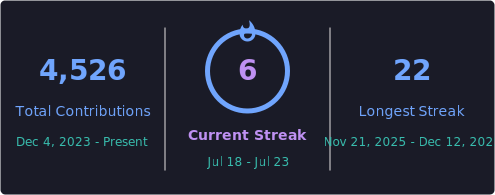

<!-- GitHub profile README — belongs in the repo KnAlex83/KnAlex83 (file: README.md) -->

---

### 🎯 About me

Mechanical engineer turned AI systems architect. I build AI products that run **in production**: on real data, with real users giving feedback every day. Not demos that die in a notebook.

My sweet spot is taking an idea from concept to a shipped system. Data architecture, LLM pipelines, voice agents, CRM integrations and the frontend on top. I own the whole path: build it, ship it, measure it.

- 🏗️ **Co-Founder @ Grovia Digital**: AI products & AI transformation for SMEs across DACH & MENA
- 🍳 **Co-Founder @ Gusto AI**: the Taste Intelligence Platform, live on iOS & Android
- 🎙️ **Shipping:** compliance-first AI voice agents (n8n · Twilio · ElevenLabs · ATS integration)
- 💬 **Talk to me about:** LLM apps in production, n8n orchestration, voice agents, CRM/ATS integrations, EU AI Act & GDPR-compliant automation
- 📍 Dubai 🇦🇪 · working across 🇩🇪 DACH and 🇬🇧 UK/MENA
- 📫 [info@grovia-digital.com](mailto:info@grovia-digital.com)

---

### 🚀 What I'm building

| Project | What it is | Status |
|---|---|---|
| **AI Match** | AI candidate matching on top of recruitment CRMs. Ranks an agency's entire candidate pool against every open job in seconds (multi-factor scoring, geo-distance, LLM job-title normalization) | 🟢 Live in production |
| **KC Agent Suite** | Multi-module AI recruiting platform: campaign engine, tender engine, pipeline, CRM sync & automated e-mail infrastructure. Role: project lead, data architecture, development | 🟢 In daily use |
| **AI Reactivate** | Permission-first outbound voice agent that reactivates dormant candidates and syncs outcomes back to the ATS. Built on n8n orchestration, Twilio telephony and ElevenLabs voice, with ATS System as source of truth | 🟢 Live call campaigns |
| **Gusto AI** | AI food intelligence platform built on a self-improving **Taste Graph** that learns individual taste and recommends across cooking, delivery and dining-out. I own the Taste Graph architecture, data infrastructure and AI roadmap | 🟢 Live on iOS & Android |
| **Grovia Digital** | My company: AI products & AI transformation, plus the platform, funnels and analytics behind it | 🟢 Ongoing |

---

### 🧩 Selected engineering work

**🎙️ Compliance-first voice agent for candidate reactivation**
An outbound AI voice agent built permission-first: value first, then double opt-in, then the call. AI disclosure from second one, instant and permanent opt-out, time-stamped consent and a complete audit log.
`n8n` orchestration · `Twilio` telephony · `ElevenLabs` voice · `any other` ATS as the leading data source
→ ~150-300 compliant calls/day · 10–14% reactivation rate · **315–950 reactivations per month**

**⚡ grovia-digital.com: a hand-rolled SSG React stack**
No meta-framework. React 19 + Vite with a custom build-time prerenderer (`renderToString` to static HTML per route, then `hydrateRoot`), so every route ships a complete first frame and still behaves as a fully interactive SPA.
→ **95+/100 mobile, 100/100 desktop** on PageSpeed with all Core Web Vitals green, via inlined critical CSS, self-hosted fonts, deferred GTM (Consent Mode v2), AVIF and per-route code-splitting.
→ SEO/GEO architecture: separate URLs per language with `hreflang`, per-route metadata, `BlogPosting` and `ProfessionalService` JSON-LD, plus an automated hydration check so a mismatch can never silently kill the performance win.

---

### 🛡️ AI governance & compliance

Building AI for EU/UK clients means compliance is a design constraint, not an afterthought. I ship systems that are **GDPR**, **EU AI Act** (Art. 50, clear AI disclosure), **UK GDPR** and **PECR** aware by design: explicit opt-in, time-stamped consent, one-click opt-out, full audit logs.

> Compliance done right stops being a brake and becomes a selling point.

---

### 🛠️ Tech Stack

**AI & Voice**

**Languages & Runtime**

**Automation & Integration**

**Frontend & Web**

**CRM, Growth & Analytics**

**Tools**

---

### 🌍 Languages

🇩🇪 **German** (native) · 🇬🇧 **English** (fluent, business & technical) · 🇷🇺 **Russian** (native)

---

### 📊 GitHub activity

> Most of my work ships inside private production systems and client repos, so the graph below tells only part of the story. The projects above are the real portfolio.

<!--
  Note: the github-readme-stats.vercel.app cards were removed because the public
  instance is heavily rate-limited and frequently fails to render (broken images).
  To bring them back reliably, deploy your own instance (free) and swap the host:
  https://github.com/anuraghazra/github-readme-stats#deploy-on-your-own-vercel-instance
  A self-hosted instance with a PAT also makes count_private / private langs work.
-->

---

  

