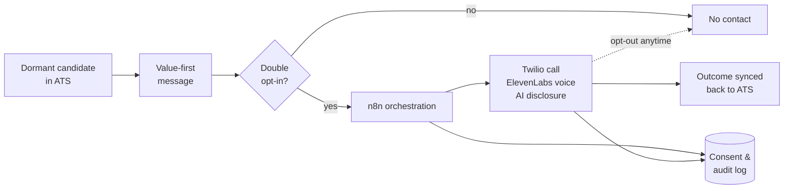
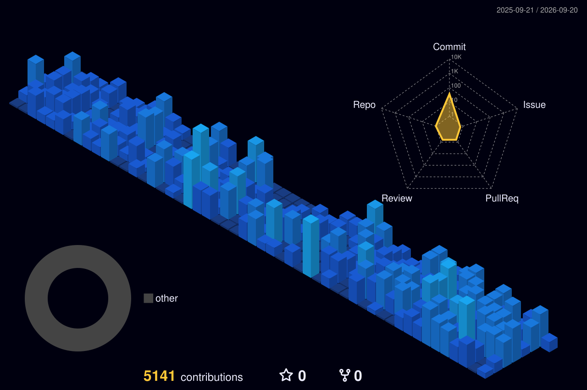
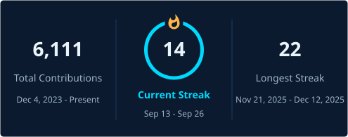

 

### 🎯 About me

Mechanical engineer turned AI systems architect. I build AI products that run **in production**: on real data, with real users giving feedback every day. Not demos that die in a notebook.

My sweet spot is taking an idea from concept to a shipped system. Data architecture, LLM pipelines, voice agents, CRM integrations and the frontend on top. I own the whole path: build it, ship it, measure it.

- 🏗️ **Co-Founder @ Grovia Digital**: AI products & AI transformation for SMEs across DACH & MENA
- 🍳 **Co-Founder @ Gusto AI**: the Taste Intelligence Platform, live on iOS & Android
- 🎙️ **Shipping:** compliance-first AI systems worldwide
- 💬 **Talk to me about:** LLM apps in production, agentic AI orchestration, voice agents, CRM/ATS integrations, EU AI Act & GDPR-compliant automation
- 📍 Dubai 🇦🇪 · working across 🇩🇪 DACH and 🇬🇧 UK/MENA
- 🌍 🇩🇪 German (native) · 🇷🇺 Russian (native) · 🇬🇧 English (fluent, business & technical)

### 🚀 What I'm building

| Project | What it is | Status |
| --- | --- | --- |
| **AI Match** | AI candidate matching on top of recruitment CRMs. Ranks an agency's entire candidate pool against every open job in seconds (multi-factor scoring, geo-distance, LLM job-title normalization) | 🟢 Live in production |
| **AI Recruiting Suite** | Multi-module AI recruiting platform: campaign engine, tender engine, pipeline, CRM sync & automated e-mail infrastructure. Role: project lead, data architecture, development | 🟢 In daily use · 1,000+ matches in month one |
| **AI Reactivate** | Permission-first outbound voice agent that reactivates dormant candidates and syncs outcomes back to the ATS | 🟢 Live call campaigns |
| **Gusto AI** | AI food intelligence platform built on a self-improving **Taste Graph** that learns individual taste and recommends across cooking, delivery and dining-out. I own the Taste Graph architecture, data infrastructure and AI roadmap | 🟢 Live on iOS & Android |
| **Grovia Digital** | My company: AI products & AI transformation, plus the platform, funnels and analytics behind it | 🟢 Ongoing |

### 🧩 Selected engineering work

<b>🎯 Campaign Engine: reverse matching for recruiters</b> — 1,000+ jobs matched in the first month

 

Most recruiting tools find candidates for a job. The Campaign Engine flips it and finds jobs for a candidate: every night it scans the job market and scores every new ad against every active candidate profile. By morning, each recruiter has a ranked shortlist.

- **Query expansion that speaks the market's language.** Profiles say "Mgr. Procurement", German job ads say "Einkäufer": 0 hits vs. 395. Titles are mapped to German occupations via a taxonomy, an LLM fallback and co-occurrence learning from the ads themselves.
- **Occupation keys at ingest.** "Sachbearbeiter Rechnungswesen (m/w/d) in Teilzeit" is recognised as an accounting role even when no word matches the profile.
- **Fetch once, score locally.** Four sources feed one market scan three times a day. Ads are cached for 45 days, so adding a recruiter costs nothing extra.
- **Guardrails instead of silent failure.** A missing location triggers a warning rather than a quietly nationwide list, and an exclusion term that would cancel the profile's own search terms is rejected, checked in both directions.
- **Human in the loop, by design.** Nothing is sent without a recruiter's explicit choice. Mails go out from the recruiter's own mailbox inside a Mon–Sat send window: 10 mailboxes, 30 mails each per day, and every push is logged in the CRM automatically.
- **Verified delivery, deliverability first.** Every send is tracked from queue to sent to opened, without tracking pixels or rewritten links. "Profile opened" is measured by a click on our own page, and hits in the first minute are flagged as corporate link scanners.

<b>🎙️ Compliance-first voice agent for candidate reactivation</b> — 515–950 reactivations per month

 

An outbound AI voice agent built permission-first: value first, then double opt-in, then the call. AI disclosure from second one, instant and permanent opt-out, time-stamped consent and a complete audit log.

```mermaid
flowchart LR
    A[Dormant candidate<br/>in ATS] --> B[Value-first<br/>message]
    B --> C{Double<br/>opt-in?}
    C -- no --> X[No contact]
    C -- yes --> D[n8n orchestration]
    D --> E[Twilio call<br/>ElevenLabs voice<br/>AI disclosure]
    E --> F[Outcome synced<br/>back to ATS]
    E -. opt-out anytime .-> X
    D --> L[(Consent &<br/>audit log)]
    E --> L
```

`n8n` orchestration · `Twilio` telephony · `ElevenLabs` voice · any ATS as the leading data source
→ ~150–300 compliant calls/day · 10–14% reactivation rate · **515–950 reactivations per month**

<b>⚡ grovia-digital.com: a hand-rolled SSG React stack</b> — 95+ mobile / 100 desktop PageSpeed

 

No meta-framework. React 19 + Vite with a custom build-time prerenderer (`renderToString` to static HTML per route, then `hydrateRoot`), so every route ships a complete first frame and still behaves as a fully interactive SPA.

→ **95+/100 mobile, 100/100 desktop** on PageSpeed with all Core Web Vitals green, via inlined critical CSS, self-hosted fonts, deferred GTM (Consent Mode v2), AVIF and per-route code-splitting.
→ SEO/GEO architecture: separate URLs per language with `hreflang`, per-route metadata, `BlogPosting` and `ProfessionalService` JSON-LD, plus an automated hydration check so a mismatch can never silently kill the performance win.

### 🛡️ AI governance & compliance

Building AI for EU/UK clients means compliance is a design constraint, not an afterthought. I ship systems that are **GDPR**, **EU AI Act** (Art. 50, clear AI disclosure), **UK GDPR** and **PECR** aware by design: explicit opt-in, time-stamped consent, one-click opt-out, full audit logs.

> Compliance done right stops being a brake and becomes a selling point.

### 🛠️ Tech stack

  

**AI, voice & automation** 

**CRM, growth & analytics** 

### 📊 GitHub activity

> Most of my work ships inside private production systems and client repos, so these graphs tell only part of the story.

  

  

  <picture>
    <source media="(prefers-color-scheme: dark)" srcset="https://raw.githubusercontent.com/KnAlex83/KnAlex83/output/github-snake-dark.svg">
    <source media="(prefers-color-scheme: light)" srcset="https://raw.githubusercontent.com/KnAlex83/KnAlex83/output/github-snake.svg">
    
  </picture>

